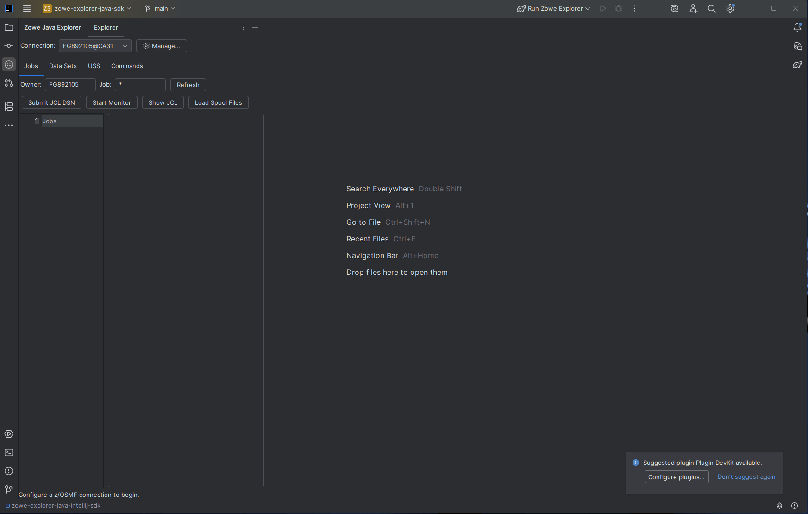

# z/OS Workbench for Zowe

Lightweight z/OS Explorer plugin for IntelliJ IDEA powered by [**Zowe Client Java SDK**](https://github.com/zowe/zowe-client-java-sdk).

This is an alternative IntelliJ plugin for performing z/OS operations directly from the IDE, offering a different approach from the existing plugin provided by the Zowe community on the JetBrains Marketplace.

This plugin is built on the **Zowe Client Java SDK**, while the existing Zowe community plugin is based on the **Zowe Client Kotlin SDK**.

I’m approaching this project as both an alternative implementation and an experiment—exploring different design choices, features, and workflows while potentially expanding the plugin to provide broader z/OS API coverage through the Zowe Client Java SDK.

---

## Main Demo



---  

## Features & Capabilities

### 🔌 Multi-Connection Profile Management
- **Multiple Connection Profiles**: Create, edit, duplicate, and remove connection profiles (`ConnectionProfile` storing Host, Port, User, SSH Port, SSH Timeout, and TSO Account).
- **Header Connection Selector**: Switch active z/OS connection profiles on the fly directly from the tool window header via a dropdown combo box.
- **Asynchronous Test Connection**: Verify z/OSMF credentials and connection settings asynchronously from the **Connection Manager** dialog (`ConnectionDialog`).
- **Secure Credentials**: Passwords are saved securely using IntelliJ's `PasswordSafe` service.
- **Seamless Migration**: Automatic background migration of legacy single-connection configurations to profile-based storage.

### 📁 Data Sets & PDS Member Management
- **Search & Mask History**: Search data sets with `DsnList`. Save up to 20 recent search masks persistently across IDE restarts in an editable combobox. Context menu and trash action allow deleting individual mask entries or clearing history.
- **Tree Node Visuals**: Clear node icons distinguishing PDS/PDSE folders (`AllIcons.Nodes.Folder`), Sequential (PS) files (`AllIcons.FileTypes.Text`), and PDS Members (`AllIcons.Nodes.C_public`).
- **Double-Click Workflows**:
    - **PDS / PDSE**: Expands members directly under the dataset tree node.
    - **Sequential (PS)**: Opens the dataset directly in an IntelliJ editor tab.
    - **Non-Sequential / Non-PDS**: Intercepts unsupported types with informative warning dialogs.
- **PDS Member CRUD Operations**:
    - **Create Member**: Right-click PDS node -> `Create Member...` with full z/OS member name validation (1–8 characters, uppercase/alphanumeric and national characters `@`, `#`, `$`). Uses `DsnWrite`.
    - **Delete Member**: Right-click member node -> `Delete...` with a confirmation prompt using `DsnDelete`.
    - **Rename Member**: Right-click member node -> `Rename...` with the input dialog using `DsnUpdate`.
    - **Refresh Members**: Right-click PDS node -> `Refresh Members`.
- **ISPF Member Metadata**: Formatted line-by-line key-value metadata display (Member, Version, Mod Level, Created, Modified, Current/Initial lines, User ID, SCLM, etc.).
- **Archived Dataset Handling**: Gracefully handles CA Disk / DFHSM / TSO recall errors (`isArchivedError` / `isArchivedDataset`) with a **"Data Set Archived"** warning dialog and missing DSORG fallback.

### 📂 Unix System Services (USS)
- **Directory Browsing, Path History & Smart Sorting**: Navigate directories and inspect file structures with `UssList`. Path field features an editable dropdown saving up to 20 recent directory paths persistently across restarts, with context menu options to delete individual entries or clear history. Subdirectories are automatically grouped at the top followed by files, sorted alphabetically (case-insensitive).
- **File Search & Real-Time Filtering**:
    - **Live Client-Side Filtering**: `Filter:` text field and `Clear` button for instant, real-time tree filtering as you type. Supports wildcards (`*.sh`, `log*`, `config?.txt`) and case-insensitive substring matching.
    - **Server-Side Search**: Passes `name` search parameters (`?name=pattern`) directly to z/OSMF via `UssListInputData` for fast server-side wildcard filtering on large mainframe directories.
- **Context Menu CRUD Operations & Tagging**:
    - **Open**: Right-click item -> `Open` (or double-click) to open text files in editor tabs or navigate directories.
    - **Open With Encoding...**: Right-click file -> `Open With Encoding...` to open remote files under an explicit encoding (e.g. `ISO8859-1`, `UTF-8`, `IBM-1047`) without altering file tags on z/OS or requiring write permissions.
    - **Change Tag (chtag)...**: Right-click file -> `Change Tag...` to set file tags (`ISO8859-1`, `UTF-8`, `IBM-1047`, `IBM-037`, `binary`, remove, or custom code set) via `UssChangeTag`. Fixes ASCII files displaying as unreadable characters when z/OSMF defaults untagged files to EBCDIC.
    - **Create File...**: Right-click -> `Create File...` to create new empty files (`rw-r--r--`) via `UssCreate`. Target directory resolves dynamically (inside the folder if a directory is right-clicked, or in the current directory if a file is right-clicked).
    - **Create Directory...**: Right-click -> `Create Directory...` to create new directories (`rwxr-xr-x`) via `UssCreate`.
    - **Rename...**: Right-click -> `Rename...` to rename files or directories in place via `UssMove`.
    - **Delete...**: Right-click -> `Delete...` to remove files or directories (recursively if a directory) via `UssDelete` with confirmation prompt.
- **Lenient Control Character Parsing**: Fallback parser (`JsonReadFeature.ALLOW_UNESCAPED_CONTROL_CHARS`) for handling USS directory listings containing raw ASCII control characters (such as ESC `0x1B` or ANSI escape codes in file names).
- **Remote File Editing & Save**: Open USS text files with `UssGet` in standard IntelliJ editor tabs with syntax highlighting. Write edits back to z/OS using `UssWrite` on `Ctrl+S` / `Save All`.

### ⚙️ Jobs Management
- **List & Inspect Jobs**: Fetch z/OS jobs via `JobGet`.
- **Submit JCL**: Submit JCL data sets directly to JES using `JobSubmit`.
- **Real-Time Job Monitoring**: Track jobs until `OUTPUT` status using `JobMonitor.waitByOutputStatus`.
- **Context-Aware Job Actions**:
    - **Cancel Job**: Right-click active/queued job -> `Cancel Job` to cancel or stop running jobs using `JobCancel`.
    - **Purge Job**: Right-click completed (`OUTPUT`) job -> `Purge Job` to delete and purge job output spool files on z/OS using `JobDelete`.
- **Spool Output & Workflows**:
    - **Double-Click Workflows**: Double-clicking a job automatically fetches and expands its spool files; double-clicking a spool file opens its content directly in the details viewer.
    - **Right-Click Context Menu & Main Editor Integration**:
        - Right-click spool file -> **Open in Main Editor** (or toolbar button **Open in Editor**): Opens the spool output in a full IntelliJ editor tab as a remote file (`zowe-spool://`).
        - Right-click spool file -> **Download Spool As...**: Downloads the spool output to the local file system.
        - Right-click spool file -> **View Spool Content**: Displays the spool output in the tool window details viewer.
        - Right-click job node -> **Load Spool Files** / **Show JCL**: Fetches spool file listings or job JCL directly.
    - **Clean Spool Labels**: Spool tree nodes display their concise `DD Name` (e.g. `JESJCL`, `JESMSGLG`, `SYSPRINT`).
    - **Formatted Spool Metadata**: Single-clicking a spool file displays formatted key-value metadata line-by-line (DD Name, Job ID, Job Name, Step Name, Proc Step, RECFM, LRECL, Byte/Record Count, Class, Records URL).
    - **Save Spool As...**: Save spool files to the local disk as text files.

### 🏷️ Symbols & Variables Management
- **Scope Selection**: Select between "Local System" and defined sysplex/system targets populated dynamically from z/OSMF topology (`ZosmfSystems`).
- **Type Toggle**: Switch seamlessly between **System Symbols** (read-only parmlib symbols) and **System Variables** (read-write z/OSMF system variables via `VariableGet`).
- **Live Search & Filtering**: Instant, client-side filtering across variable names, values, and descriptions as you type.
- **Variable CRUD & Operations**:
    - **Add Variable**: Create new z/OSMF system variables with Name, Value, and Description via `VariableCreate`.
    - **Edit Variable**: Modify existing variable values and descriptions (`VariableCreate`).
    - **Rename Variable**: Rename variables on z/OSMF (`VariableCreate` and `VariableDelete`).
    - **Delete Variable**: Multi-select deletion of system variables with confirmation prompt (`VariableDelete`).
    - **Copy Name / Value**: Quick right-click context menu actions to copy variable names or values to the clipboard.

### 💻 Commands & Terminals
- **Stateful TSO Terminal**: Issue stateful TSO commands (`TsoStart`, `TsoCmd.issueCommandByTsoSessionId`, `TsoStop`) reusing a single TSO address space across commands.
- **MVS Console**: Execute MVS console commands using `ConsoleCmd`.
- **USS SSH Terminal**: Execute remote SSH commands on z/OS Unix System Services using `UssCmd` with host-key verification (`~/.ssh/known_hosts`).

### 🎨 Responsive UI & Layout Customization
- **Wrapping Toolbars**: Custom `WrapLayout` implementation across all toolbars (**Jobs**, **Data Sets**, **USS**, **Commands**, and **Connection Manager**), allowing action buttons and filter inputs to wrap onto new lines automatically when narrowing tool window splitters or panes.
- **Line-Wrapped Detail Views**: Detail view text areas feature word-wrapping (`setLineWrap(true)`, `setWrapStyleWord(true)`), preventing long job details, spool outputs, dataset metadata, and command outputs from clipping or disappearing.
- **Tree Node Tooltips**: Integrated tooltips on tree controls (`jobsTree`, `dsnTree`, `ussTree`) to display full item names when hovering over truncated nodes.

### 💾 Remote Editor Integration & Concurrency Protection
- **Global Save Interception**: Listens to IntelliJ save actions (`Ctrl+S`, `Save All`, File menu save) and application bus events (`FileDocumentManagerListener`) to write back modified remote editor tabs (`LightVirtualFile`).
- **Auto-Save on Tab Close**: Saves modified remote editors when closing tabs.
- **Optimistic Concurrency & Conflict Protection**: Re-reads remote files prior to writing and compares content against the initial baseline. Prompts user with **Overwrite Remote**, **Reload Remote**, or **Cancel** if mainframe content changed concurrently.

---

## Architecture

```text
IntelliJ UI (Zowe Tool Window)
  │
  ├── Connection Profile Manager (PasswordSafe & Persistence)
  ├── JobService -------- JobGet / JobSubmit / JobMonitor / JobCancel / JobDelete
  ├── DataSetService ---- DsnList / DsnGet / DsnWrite / DsnDelete / DsnUpdate
  ├── UssService -------- UssList / UssGet / UssWrite / UssCreate / UssDelete / UssMove
  ├── CommandService ---- TsoStart / TsoCmd / TsoStop / ConsoleCmd / UssCmd
  ├── SymbolService ----- VariableGet / VariableCreate / VariableDelete / ZosmfSystems
  └── RemoteEditorManager
       ├── LightVirtualFile / FileEditorManager
       └── Action & Document Save Listeners -> DsnWrite / UssWrite
  │
Zowe Client Java SDK
  │
z/OSMF / z/OS
```

---

## Development & Building

### Prerequisites
- Java 21 JDK
- IntelliJ IDEA (2025.1 or newer)

### Run in Sandbox IDE
Run the IDE sandbox using Gradle:

```bash
gradlew runIde
```

In the sandbox IDE:
1. Open **View -> Tool Windows -> z/OS Workbench**.
2. Click **Manage...** or **Connection** to set up a z/OS connection profile (z/OSMF host, port, credentials).
3. Click **Test Connection** to verify settings.
4. Browse **Data Sets**, **USS**, **Jobs**, and execute **Commands**.
5. Double-click a data set/member or USS file to open it in the main IntelliJ editor. Alternatively, right-click the selected item and choose Open.
6. Edit normally and use **Ctrl+S** or **Save All** to write the contents back to z/OS.

### Build Installable Plugin Package

```bash
gradlew buildPlugin
```

The compiled plugin package ZIP will be located in:

```text
build/distributions/com.frankgiordano.zowe.explorer.java-1.0.3.zip
```

To install locally in IntelliJ:
1. Open **Settings / Preferences -> Plugins**.
2. Click the gear icon ⚙️ and select **Install Plugin from Disk...**.
3. Select the generated `.zip` file from `build/distributions/`.

---

## 🚀 Publishing to JetBrains Marketplace

### Option A: Manual Web Upload (Recommended for First Release)

1. **Build the Plugin Distribution**:
   ```bash
   gradlew buildPlugin
   ```
   Verify that the output package `build/distributions/com.frankgiordano.zowe.explorer.java-1.0.3.zip` exists.

2. **Verify Plugin Compatibility**:
   ```bash
   gradlew verifyPlugin
   ```

3. **Log in to JetBrains Marketplace**:
   Go to [JetBrains Marketplace Publisher Portal](https://plugins.jetbrains.com/). Log in with your JetBrains Account.

4. **Upload New Plugin**:
    - Click your avatar/account icon in the upper-right.
    - Look for Upload plugin rather than Add Plugin.
    - Drag and drop or upload the ZIP file from `build/distributions/`.
    - Select license terms and complete the verification details.
    - JetBrains will perform automated security and compatibility verification. Once approved, your plugin will be available publicly in the Marketplace.

---

### Option B: Automated Publishing via Gradle

You can publish directly from the command line or CI/CD pipelines using the JetBrains Marketplace Publisher API token.

1. **Generate Publisher Token**:
    - Log in to [plugins.jetbrains.com](https://plugins.jetbrains.com/).
    - Click your profile picture -> **My Tokens**.
    - Click **Generate Token** and copy the token value.

2. **Configure Token**:
   Set the token as an environment variable or Gradle property:
   ```bash
   export PUBLISH_TOKEN="perm:your_jetbrains_marketplace_token"
   ```

3. **Publish Command**:
   ```bash
   gradlew publishPlugin -PintellijPlatform.publishing.token=$env:PUBLISH_TOKEN
   ```

---

## License & Credits

Powered by [Zowe Client Java SDK](https://github.com/zowe/zowe-client-java-sdk). Developed by Frank Giordano.
